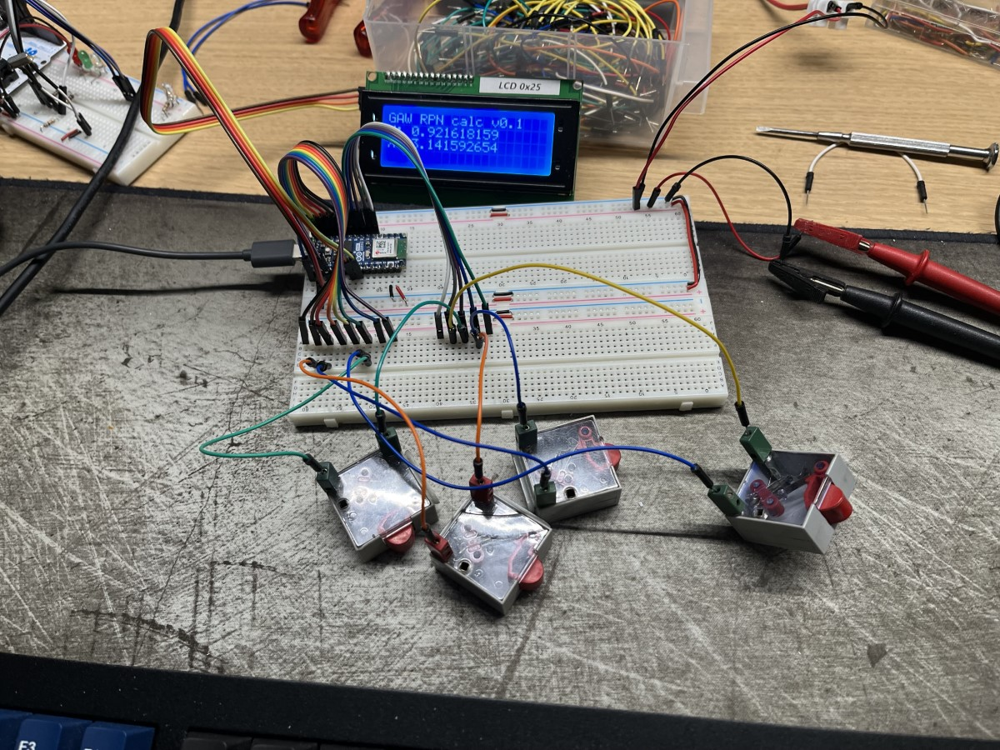
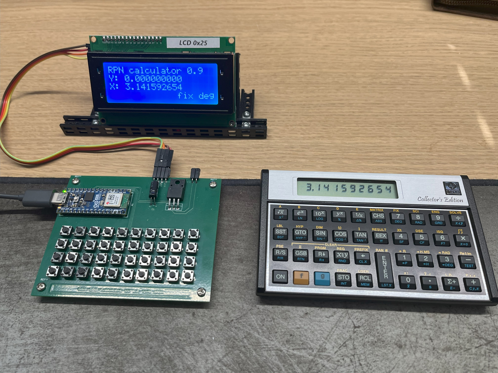

# GAW-RPN-Calculator
 HP like RPN calculator on Arduino, loosely based on the HP-15C. 
 It has no programming capabilities yet, perhaps in a future expansion.

## Hardware
 The project was built on an Arduino NANO ESP32, using a 20x4 I2C LCD display. 
 It needs a keyboard of 4 rows by 10 columns. For decoding we use a matrix of 5 rows and 8 columns. 
 The fifth row handles the eigth buttons in the two columns on the far right, thus saving one pin.

 Here is the prototype, on my test bench:

 

 And here is the prototype based on the print of my own design:

 

## Software
 In the setup routine there's a place called 'TEST AREA' in the comments surrounding it.
 A few testscenarios have been packed in this repository as include files.
 The include statements for them are there in the code, albeit commented out.
 Use them at you convenience.

### To shift or not to shift...
 As you might know, HP calculators work with shift keys. The 15-C has two of them.
 They are called 'f' and 'g'. The keyhandling therefor consists of three routines.
 These routines are called:
 - handleNoShift()
 - handleShiftF()
 - handleShiftG()

### Handling of keys and functions
 All keys in the matrix are tested for.
 All calculator functions have been named in the parts of the program that handle keypresses. 
 The ones that are coded already are actually being called.
 Those that are not coded yet have comments with their name / function.

### Completeness?
 The HP15 calculator functions have been implemented, except for the ones below.
 Who knows, perhaps in the future.
- Programming capabilities
- SOLVE functionality
- MATRIX functionality
- SCI and ENG notations
- HYP and HYP-1 functions
- I and (i) register handling
- Hour, minute, seconds / decimal conversions

## Implemented functions
 The functions that have been coded and bound to their respective keys are listed here.

### Logaritmic

- LOG10()         // 10 log OF X
- TENtoX()        // 10 TO THE POWER OF X
- LOG()           // natural log OF X
- EtoX()          // e TO THE POWER OF X

### Algebraic

- SQRT()          // Square root
- SQ()            // Square
- POW()           // Y to the power of X
- PERCENT()       // Take X perecnt of Y
- DIFPERCENT()    // Percent difference
- OneOverX()      // 1 / X
- CHS()           // Change Sign
- ABS()           // Absolute value
- INT()           // Make X = INT(X)
- RANDOM()        // Generate random number
- FAC()           // Calculate factorial of X
- ADD()           // Add X to Y
- SUBTRACT()      // Subtract Y from X
- MULTIPLY()      // Multiply Y by X
- DIVIDE()        // Divide Y by X

### Goniometric

- DEG()           // switch mode to Degrees
- RAD()           // switch mode to Radians
- GRD()           // switch mode to Gradians
- SIN()           // Sine of X
- ASIN()          // Arcsine of X
- COS()           // Cosine of X
- ACOS()          // Arccosine of X
- TAN()           // Tangent of X
- ATAN()          // Arctangent of X
- toRAD()         // degrees to radians
- toDEG()         // radians to degrees
- PI()		        // Give value of PI
- toRectlr        // Polar to Rectangular
- toPolar         // Rectangular to Polar

### Statistics

- clearStats()    // Clear statistic registers f Clear E
- sigmaPlus()     // Accumulate datapoints E+
- sigmaMinus()    // Correct datapoints E-
- meanValues()    // Calculate mean values
- stdDev()        // Calculate standard deviation s
- linRegr()       // Linear Regression L.R.
- linEstim()      // Linear Estimation f ^y,r
- permu()         // Permutations Py,x
- combi()         // Combinations Cy,x

### Calculator

- clearRegs()     // Clear all 30 registers
- clearShiftState() // Clear f or g state
- STO()           // Store value in register
- RCL()           // Recall value from register
- CLX()           // Clear X register
- lstX()          // Recall last value of X
- FIX()           // Set precision (default 4)
- swapXY()        // Exchange values of X and Y
- push()          // Push number on stack
- rollDown()      // Roll stack down
- rollUp()        // Roll stack up

